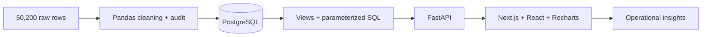

# Payment Intelligence

A branded payment operations workspace backed by **real PostgreSQL analytics**. Explore settlement performance, payment failures, retries and data quality across a reproducible synthetic international payment dataset.


## Run locally

## Live deployment

The repository includes a Render Blueprint in `render.yaml`. It provisions one Docker web service and one PostgreSQL database in Frankfurt, builds the Next.js interface into the same web image as FastAPI, and runs the deterministic data pipeline once after the first successful deployment.

In Render, create a new Blueprint from this GitHub repository and apply it. The free web service sleeps after inactivity, and the free PostgreSQL database expires after 30 days; upgrade the database for a durable portfolio deployment. No secrets are stored in the repository.

### Docker (portable setup)
1. Install Docker and copy `.env.example` to `.env`.
2. Set `POSTGRES_PASSWORD` to a strong local password (URL-safe characters).
3. Run:
```sh
docker compose up -d db
docker compose --profile seed run --rm pipeline
docker compose up --build -d api frontend
```
Open **http://localhost:3000**. API documentation: **http://localhost:8000/docs**.

The seed command is for a fresh database. It refuses to erase existing payments. PostgreSQL data persists in a named volume. Compose keeps app ports on loopback and does not publish the database port. Docker configuration is provided but not runtime-verified on the development machine.

### Existing PostgreSQL, Python and Node
Requires PostgreSQL 17+, Python 3.13 and Node 22+.
```sh
python -m venv .venv
# Windows: .venv\Scripts\activate
# macOS/Linux: source .venv/bin/activate
pip install -r backend/requirements.lock.txt
```
Create a new empty `payment_intelligence` database and set `DATABASE_URL` in `.env`. Then:
```sh
python -m scripts.pipeline --load
python -m uvicorn backend.main:app --host 127.0.0.1 --port 8000
```
In a second terminal:
```sh
cd frontend
npm ci
npm run dev
```

### This Windows workspace
A project-local PostgreSQL runtime has already been initialized and seeded under ignored `.runtime/`, bound to `127.0.0.1:55432`. Its randomly generated credential is in ignored `.env`. There is no system service installation. See `docs/local-runtime.md` for restart/stop commands. Do not share `.env`, `.runtime/` or database files.

## Product
- **Overview:** four core metrics, a daily value chart, database-derived insights, failure causes, country rankings and retry recovery.
- **Payments:** server-side search, filters and pagination; inspect attempt timelines in a keyboard-accessible dialog.
- **Analytics:** focused views for trends, markets, failures, segments, methods and retries.
- **Data Quality:** acceptance, corrections, rejections, outliers and post-load database validation.
- **Methodology:** explicit assumptions and metric definitions.

The visual system translates the supplied branding into acid green (#78FF00), charcoal and warm white. It uses a custom geometric wordmark, rounded controls, open KPI spacing and a dark editorial insights panel. The reference brands themselves are not reused.

## Architecture


|Layer|Implementation|
|---|---|
|Database|PostgreSQL; keys, constraints, indexes and six reusable views|
|Data pipeline|Seeded Python generator; Pandas cleaning; row-level audit; transactional COPY|
|API|FastAPI/Pydantic; typed input validation; parameterized psycopg queries|
|Frontend|Next.js, React, TypeScript, Recharts, Lucide; custom token-based CSS|
|Development|Isolated Python environment, locked dependencies, Docker definitions|

All core metrics are computed in SQL. The frontend formats results and renders charts; it never downloads the full 50,000-payment dataset. Monetary values are aggregated in EUR using documented synthetic rates. Success excludes pending payments; gross settled volume includes later refunds.

## Repository guide
```
backend/       API, database connection, SQL repository
frontend/      Next.js app and shared UI components
sql/           schema, views, analytical examples, quality checks
scripts/       data generation, cleaning, validation and loading
data/raw/      generated source CSV (ignored)
data/clean/    accepted CSV, audit and summary (ignored)
tests/         cleaning, known-value analytics and API integration tests
docs/          product, architecture, data, analytics and brand decisions
screenshots/   verified application captures
```

## Validation
```sh
python -m pytest tests -q
cd frontend
npm run build
```
Twelve tests cover deterministic cleaning, audit reconciliation, outlier handling, exact known-value SQL calculations, retry de-duplication, inclusive dates, zero-filled trends, validation, pagination, literal search, empty denominators and API behavior. Integration tests use PostgreSQL temporary tables and rollback, leaving durable payments untouched. `DATABASE_URL` is required; without it, database tests are skipped rather than silently using SQLite.

The seeded run accepted 49,770 payments from 50,200 rows, corrected 450 unique records, rejected 430 rows and retained 21 outliers. Five post-load SQL checks passed.

## Documentation and case study
- [Product goals](docs/product-overview.md)
- [Architecture and deployment](docs/architecture.md)
- [Database relationships](docs/database.md)
- [Data pipeline and assumptions](docs/data-pipeline.md)
- [Metric definitions and SQL analysis](docs/analytics.md)
- [Design system and wireframe](docs/design-system.md)
- [Portfolio narrative](docs/case-study.md)
- [Verification record](docs/verification.md)

Portfolio destination: [eshgin.com](https://eshgin.com). Prepared for a future GitHub/Behance case study; no repository or external publication has been created.

## Synthetic-data disclosure
Every customer, merchant and payment is fictional. The data pipeline, PostgreSQL storage, SQL calculations, API and interactions are implemented. This application does not process real payments. It is a local portfolio project; public production hosting, authentication, backups and monitoring are outside the current local setup.
