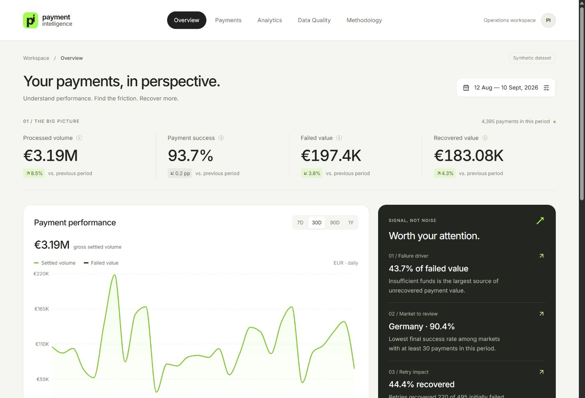
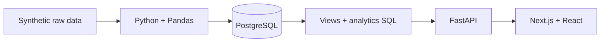

# Payment Intelligence

A full-stack payment analytics platform for operations teams. It turns a reproducible synthetic payment dataset into trusted PostgreSQL metrics, API-driven insights, and a responsive dashboard.



## What it does

- Tracks processed volume, success rate, failed value, and recovered value.
- Explains failure impact by reason, country, payment method, and customer segment.
- Measures second- and third-attempt retry effectiveness.
- Provides a searchable, paginated payment explorer with attempt timelines.
- Shows the cleaning audit, rejected records, retained outliers, and database checks.
- Documents every assumption and metric used in the analysis.

## Architecture



| Layer | Stack |
| --- | --- |
| Frontend | Next.js, React, TypeScript, Recharts |
| API | FastAPI, Pydantic, psycopg |
| Database | PostgreSQL with constraints, indexes, and reusable views |
| Data pipeline | Python, Pandas, transactional PostgreSQL COPY |
| Deployment | Docker and Render Blueprint |

Core metrics are calculated in SQL and returned through the API. The browser never downloads the entire dataset.

## Dataset and validation

The seeded pipeline generated 50,200 raw rows and produced:

- 49,770 accepted payments
- 450 corrected records
- 430 rejected rows
- 21 retained and flagged outliers
- 5 passing post-load database checks

All customers, merchants, and payments are fictional. The data model, cleaning pipeline, SQL, API, calculations, filters, and visualizations are fully implemented.

## Run with Docker

Copy `.env.example` to `.env`, set a strong `POSTGRES_PASSWORD`, then run:

```sh
docker compose up -d db
docker compose --profile seed run --rm pipeline
docker compose up --build -d api frontend
```

Open [http://localhost:3000](http://localhost:3000). API documentation is available at [http://localhost:8000/docs](http://localhost:8000/docs).

The seed command expects a fresh database and refuses to erase existing payments.

## Deploy on Render

`render.yaml` provisions a PostgreSQL database and one Docker web service containing the exported Next.js interface and FastAPI API. Create a Render Blueprint from this repository and apply it. The deterministic data pipeline runs once after the first successful deploy.

Render’s free PostgreSQL database expires after 30 days. Upgrade it for a durable portfolio deployment.

## Tests

```sh
python -m pytest tests -q
cd frontend
npm run build
```

The project has 12 passing tests for cleaning, audit reconciliation, known-value SQL metrics, retries, filters, pagination, date boundaries, empty states, and API validation.

## Project structure

```text
backend/      FastAPI application and SQL repository
frontend/     Next.js dashboard and design system
scripts/      Data generation, cleaning, validation, and loading
sql/          Schema, views, analytics, and quality checks
tests/        Pipeline and PostgreSQL API tests
docs/         Architecture, methodology, and case-study notes
screenshots/  Verified desktop and mobile captures
```

Detailed documentation: [architecture](docs/architecture.md) · [database](docs/database.md) · [data pipeline](docs/data-pipeline.md) · [analytics](docs/analytics.md) · [design system](docs/design-system.md) · [verification](docs/verification.md)
