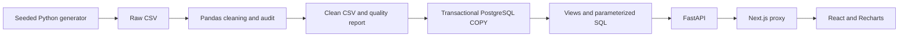

# Architecture

`scripts/pipeline.py` owns data generation and ingestion. `sql/` owns schema, reusable views and inspectable analysis. `backend/repository.py` owns filtered queries. `backend/main.py` validates requests and exposes OpenAPI. `frontend/components/` owns the presentation and interaction layer. No dashboard statistics are hardcoded in React.

Each API request opens a database connection with a five-second connection timeout and ten-second statement timeout. Multi-query responses run in a repeatable-read, read-only transaction to avoid inconsistent dashboard snapshots. This is deliberately simple; connection pooling and authentication are future production work.

Next.js rewrites `/api/*` to FastAPI. Same-origin requests avoid permissive CORS. The backend URL is configured at build time for production rewrites. Docker supplies `http://api:8000` as a build argument. Dates use UTC and queries use inclusive calendar-day boundaries. Results are bounded: at most 100 payment rows and 731 trend days per request.

## Deployment readiness
Dockerfiles and Compose describe PostgreSQL, seeding, API and frontend services. They have not been executed on this machine because Docker is unavailable. The actual application was tested against project-local PostgreSQL, FastAPI and Next.js.

Before public hosting: provision PostgreSQL and a Python host, configure HTTPS and authentication, use separate least-privilege database roles, configure backup/restore and monitoring, and set the correct API origin during the frontend build. Do not expose this local portfolio workspace directly to public traffic.
