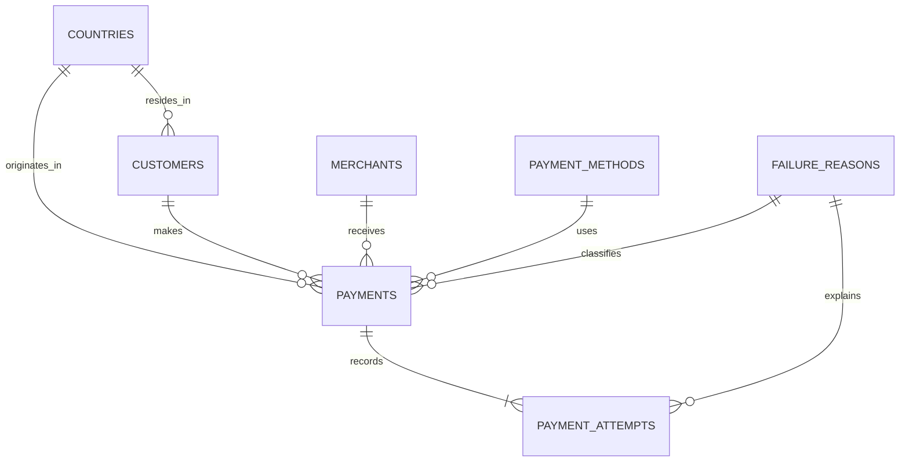

# Relational model

`payments` stores local amounts, fixed-rate EUR equivalents, final status, initial failure reason, current failure reason, attempt count, initiation and settlement times. `payment_attempts` records the actual modeled sequence. Recovered payments have an initial failure reason but no final failure reason. Refunded payments have a successful processing history; refund timing is not generated.

Primary keys prevent duplicate entities. Foreign keys prevent orphaned facts. Checks enforce positive amounts, valid statuses, settlement timing and final-failure consistency. Unique `(payment_id, attempt_number)` prevents duplicate attempts. Post-load checks reconcile attempt counts and currencies. Numeric amounts use exact fixed precision in storage.

Indexes support time, country/date, status/date, payment method/date and customer lookups. Payment detail queries use the primary key; attempt lookup uses the unique composite index. Search uses bounded ILIKE filters; at substantially greater scale a trigram index would be appropriate.

Reusable views: `payment_facts`, `payment_summary`, `daily_payment_metrics`, `country_performance`, `failure_analysis`, `retry_performance`. The API applies parameterized predicates to `payment_facts`, so all analytics honor the same filters.

The loader refuses a nonempty payment table, never truncates it, and rolls back the entire load on failure. Generate into a fresh database to rerun ingestion. Tests use temporary tables and rollback; durable payments remain unchanged.
